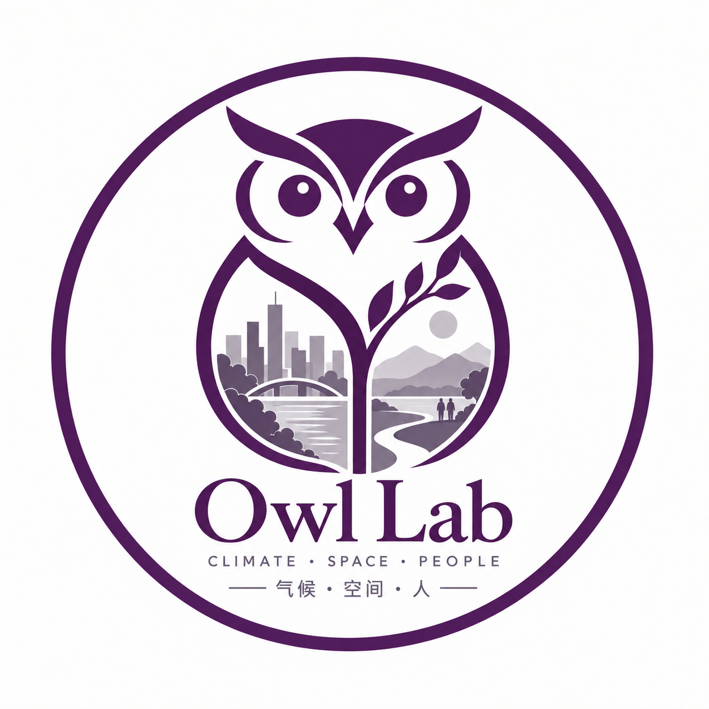

::: {.page-intro .about-intro}
::: {.about-hero-copy}
# About Owl Lab {.initial-accent}

<strong>Owl Lab studies the complex and evolving relationships between climate, urban space, and people.</strong>

Our research begins with urban climate and the built environment: how spatial conditions shape environmental processes, how these processes become human exposure, perception, and behavior, and how such knowledge can inform climate-responsive design and planning.

:::

{.about-hero-logo alt="Owl Lab logo"}
:::

::: {.about-prose}
We work across scales—from cities and urban blocks to public spaces and individual experience—and draw on field observation, remote sensing, numerical simulation, spatial analysis, and emerging computational methods. Rather than defining the lab by a single object or technique, we are interested in questions that matter and in meaningful connections across scales, methods, and forms of evidence.
:::

::: {.editorial-section .why-owl}
::: {.section-head}
Owl

## Why Owl? {.initial-accent}
:::

The name Owl Lab began with a simple association.

Owls evoke curiosity, observation, and knowledge, while the word itself also carries a small personal connection to the lab's founder. As the group takes shape, we have begun to give the three letters another meaning.

::: {.owl-groups}
::: {.owl-group .owl-research}
### How we research

Observe · Weigh · Link

::: {.owl-terms}
::: {}
#### Observe
Start from the world as it is, and pay close attention to complex and changing urban environmental processes.
:::
::: {}
#### Weigh
Examine evidence, compare explanations, and take uncertainty and boundaries seriously.
:::
::: {}
#### Link
Connect scales, methods, and experiences to understand climate, space, and people as parts of the same problem.
:::
:::
:::

::: {.owl-group .owl-grow}
### How we grow

Open · Wonder · Learn

::: {.owl-terms}
::: {}
#### Open
Remain open to different perspectives, unfamiliar questions, and new paths of inquiry.
:::
::: {}
#### Wonder
Keep the curiosity to notice what does not yet make sense—and to keep asking why.
:::
::: {}
#### Learn
Treat research as an ongoing process of learning, revising judgment, and growing together.
:::
:::
:::
:::

These are not fixed definitions of OWL, but a current expression of how we think about doing research and growing together.

:::
