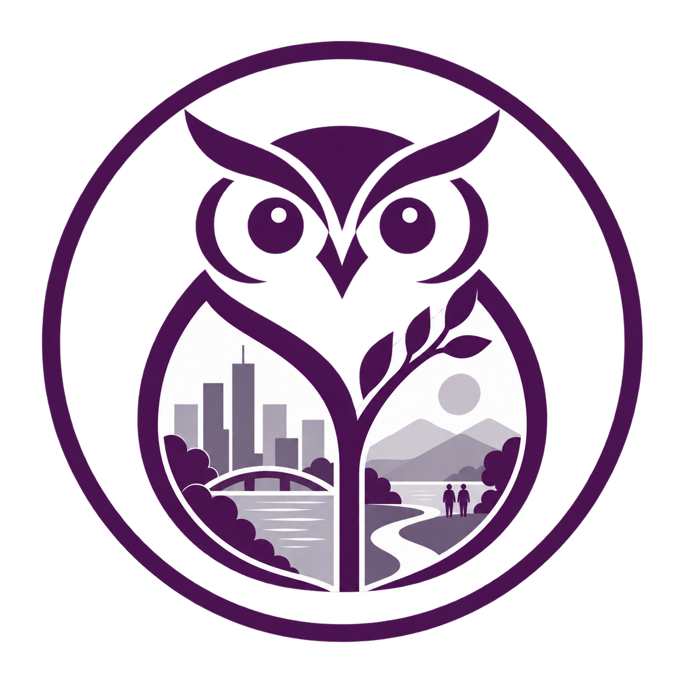

::: {.hero .lab-hero}
::: {.hero-copy}
# Owl Lab

Urban Climate · Built Environment · People

气候 · 空间 · 人

We try to disentangle the complex and continually changing relationships among climate, urban space, and people.

::: {.academic-description}
Owl Lab studies how built environments and urban environmental processes interact under climate change, how spatial conditions and interventions shape microclimates and thermal environments, how these changes affect human exposure, perception, behavior and health across scales, time and extreme climate conditions, and how the resulting evidence can inform climate-responsive architectural and urban design.
:::
:::

:::

::: {.editorial-section}
::: {.section-head}
1 + 3

## Research {.initial-accent}
:::

::: {.research-matrix}
::: {.research-umbrella}
气候响应型建成环境
<strong>Climate-responsive Built Environment</strong>
:::
::: {.research-tile .thread-violet}

01

<a href="research/space-process/">城市空间与环境过程</a>

Urban Space &amp; Environmental Processes

How do spatial conditions and interventions produce environmental effects?

:::
::: {.research-tile .thread-clay}

02

<a href="research/human-environment/">人与环境交互</a>

Human–Environment Interaction

How do environmental conditions become lived experience and outcomes?

:::
::: {.research-tile .thread-blue-grey}

03

<a href="research/sensing-modelling/">环境感知、建模与计算</a>

Environmental Sensing, Modelling &amp; Computation

How can urban processes be sensed, quantified and modelled more appropriately?

:::
:::
:::

::: {.editorial-section .notebook-gateway}
::: {.section-head}
Living guide
## Notebook {.initial-accent}
:::

Stay curious about questions, patient with growth, and honest with one another.

We take research seriously, and relate to one another with lightness.

::: {.notebook-cta}
[Enter the Owl Lab Notebook →](notebook/index.qmd){.text-link}
:::
:::

::: {.editorial-section .home-compact}
::: {.section-head}
Meet the group
## People {.initial-accent}
:::
::: {.section-main}

<strong>Wanlu Ouyang · 欧阳婉璐 · PI</strong>

School of Architecture and Urban Planning, Nanjing University  
南京大学建筑与城市规划学院

Assistant Professor / Research Fellow

[People and joining →](people.qmd){.text-link}
:::
:::

::: {.editorial-section .home-compact}
::: {.section-head}
Recent
## News {.initial-accent}
:::
::: {.section-main}

::: {.home-news-entry}

<strong>Owl Lab website launched.</strong>
Owl Lab 网站上线。

2026.09.27
:::

[More news →](news.qmd){.text-link}
:::
:::
