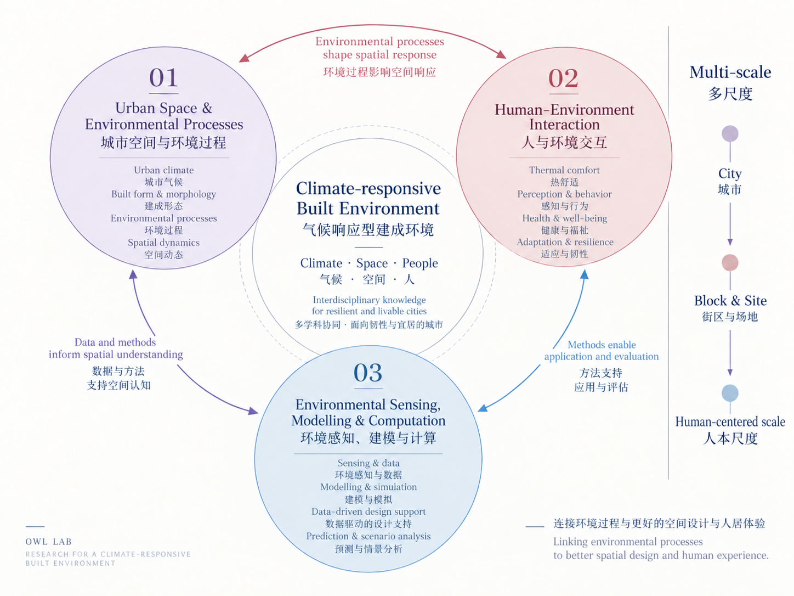

::: {.page-intro}
# Research {.page-title .initial-accent}

We start from space, trace environmental processes, connect them to people, and bring the resulting knowledge back to design.

:::

::: {.editorial-section}
::: {.section-head}
Framework

## Conceptual framework
:::

<figure class="research-framework-figure">
  
</figure>
:::

::: {.editorial-section}
::: {.section-head}
1 + 3

## Research threads
:::

::: {.research-index .research-index-three}
::: {.project-row .thread-violet}

01 · Space &amp; process

::: {}
### [Urban Space &amp; Environmental Processes](space-process/)
城市空间与环境过程

How do spatial conditions and interventions produce environmental effects, and how do these effects change across time, scale and climate?

:::
:::
::: {.project-row .thread-clay}

02 · Human &amp; environment

::: {}
### [Human–Environment Interaction](human-environment/)
人与环境交互

How do environmental conditions become human exposure, perception, behavior and health, and how can this knowledge inform spatial design?

:::
:::
::: {.project-row .thread-blue-grey}

03 · Methods &amp; computation

::: {}
### [Environmental Sensing, Modelling &amp; Computation](sensing-modelling/)
环境感知、建模与计算

How can urban environmental processes be sensed, quantified and modelled more accurately and efficiently?

:::
:::
:::
:::

::: {.editorial-section .funded-projects}
::: {.section-head}
Funded

## Funded Projects {.initial-accent}
:::

The source record provides Chinese titles only; English titles and funding names below are working translations.

::: {.funded-project-group}
### Projects led by Owl Lab

::: {.funded-project .funded-project-led .thread-violet}

2027–2029National Natural Science Foundation of China Young Scientists Fund · PI

<h3>Dynamic Thermal Exposure Mechanisms and Spatial Optimisation of New Urban District Streets for Age-Friendly Walking: A Case Study in a Hot-Summer Cold-Winter Climate</h3>

Studies dynamic thermal exposure on streets in new urban districts for age-friendly walking in hot-summer cold-winter climates, with implications for spatial optimisation.

Human–Environment InteractionUrban Space &amp; Environmental Processes

:::

::: {.funded-project .funded-project-led .thread-sage}

2026–2028Natural Science Foundation of Jiangsu Province Young Scientists Fund · PI

<h3>Thresholds and Spatial Configuration Methods for Thermal-Environment Improvement through Precision Greening in Urban Block Renewal</h3>

Examines thermal-improvement thresholds and spatial configuration methods for precision greening in urban block renewal.

Urban Space &amp; Environmental Processes

:::

::: {.funded-project .funded-project-led .thread-blue-grey}

2025–2027Open Research Project of the Ministry of Education Key Laboratory of High-Density Human Settlements Ecology and Energy Conservation · PI

<h3>Dynamic Cooling Mechanisms and Optimisation of Urban Blue-Green Spaces Based on Explainable Artificial Intelligence (XAI)</h3>

Studies the dynamic cooling mechanisms of urban blue-green spaces and explores optimisation supported by explainable artificial intelligence.

Urban Space &amp; Environmental ProcessesEnvironmental Sensing, Modelling &amp; Computation

:::

::: {.funded-project .funded-project-led .thread-blue-grey}

2025–2026Open Fund Project of the Key Laboratory of Monitoring, Evaluation and Early Warning for Territorial Spatial Planning, Ministry of Natural Resources · PI

<h3>Intelligent Layout and Optimisation Methods for Blue-Green Spaces in Urban Renewal towards Improved Heat Resilience</h3>

Develops intelligent layout and optimisation methods for blue-green spaces in urban renewal oriented towards improved heat resilience.

Urban Space &amp; Environmental ProcessesEnvironmental Sensing, Modelling &amp; Computation

:::
:::
:::

::: {.editorial-section .selected-publications}
::: {.section-head}
Selected

## Selected Publications {.initial-accent}
:::

::: {.publication-groups}
::: {.publication-group .thread-violet}
### 01 Urban Space &amp; Environmental Processes

城市空间与环境过程

::: {.publication-entry}
2020
<h4>The cooling efficiency of variable greenery coverage ratios in different urban densities: A study in a subtropical climate.</h4>
Ouyang, W., Morakinyo, T. E., Ren, C., &amp; Ng, E. <em>Building and Environment</em>, 174, 106772.

<strong class="publication-microhead">Greenness × urban density: how does cooling efficiency change?</strong>Examines how cooling performance varies across combinations of greenery coverage and urban density.
<a href="https://doi.org/10.1016/j.buildenv.2020.106772">DOI / View paper →</a>

:::
::: {.publication-entry}
2023
<h4>How to quantify the cooling effects of green infrastructure strategies from a spatio-temporal perspective: Experience from a parametric study.</h4>
Ouyang, W., Morakinyo, T. E., Lee, Y., Tan, Z., Ren, C., &amp; Ng, E. <em>Landscape and Urban Planning</em>, 237, 104808.

<strong class="publication-microhead">Putting cooling back into space and time.</strong>Quantifies green-infrastructure cooling from a spatio-temporal perspective and traces how its performance varies across spatial and temporal conditions.
<a href="https://doi.org/10.1016/j.landurbplan.2023.104808">DOI / View paper →</a>

:::
::: {.publication-entry}
2025
<h4>The dual impacts of built environment on extreme heat and urban heat resilience: A comparative study in Beijing.</h4>
Liu, Q., Ouyang, W., Tan, Z., Mei, Y., &amp; Bai, B. <em>Urban Climate</em>, 64, 102618.

<strong class="publication-microhead">How does urban space shape both extreme heat and heat resilience?</strong>Examines how built-environment attributes relate to thermal conditions and urban heat resilience during extreme heat.
<a href="https://doi.org/10.1016/j.uclim.2025.102618">DOI / View paper →</a>

:::
:::

::: {.publication-group .thread-clay}
### 02 Human–Environment Interaction

人与环境交互

::: {.publication-entry}
2025
<h4>Comparative evaluation of PET and mPET models for outdoor walking in hot-humid climates.</h4>
Ouyang, W., Tan, Z., Chen, Y.-C., &amp; Ren, G. <em>Building and Environment</em>, 271, 112636.

<strong class="publication-microhead">What happens to thermal comfort metrics when people start walking?</strong>Compares PET and mPET for outdoor walking in hot-humid climates, bringing thermal assessment into a dynamic pedestrian context.
<a href="https://doi.org/10.1016/j.buildenv.2025.112636">DOI / View paper →</a>

:::
::: {.publication-entry}
2025
<h4>The comparative thermal experience of young and old pedestrians in urban green spaces and in densely built areas.</h4>
Tan, Z., Christopoulos, G., Roberts, A. C., Ren, G., Ouyang, W., Lo, K., &amp; Ho, C. <em>Urban Forestry &amp; Urban Greening</em>, 105, 128712.

<strong class="publication-microhead">Same city, different ages, different thermal experiences?</strong>Compares young and older pedestrians across urban green spaces and densely built areas, linking thermal experience to both people and place.
<a href="https://doi.org/10.1016/j.ufug.2025.128712">DOI / View paper →</a>

:::
:::

::: {.publication-group .thread-blue-grey}
### 03 Environmental Sensing, Modelling &amp; Computation

环境感知、建模与计算

::: {.publication-entry}
2021
<h4>Evaluating the thermal-radiative performance of ENVI-met model for green infrastructure typologies: Experience from a subtropical climate.</h4>
Ouyang, W., Sinsel, T., Simon, H., Morakinyo, T. E., Liu, H., &amp; Ng, E. <em>Building and Environment</em>, 108427.

<strong class="publication-microhead">Can the model capture thermal-radiative conditions around green infrastructure?</strong>Evaluates ENVI-met against measured thermal-radiative conditions across different green-infrastructure typologies.
<a href="https://doi.org/10.1016/j.buildenv.2021.108427">DOI / View paper →</a>

:::
::: {.publication-entry}
2022
<h4>Comparing Different Recalibrated Methods for Estimating Mean Radiant Temperature in Outdoor Environment.</h4>
Ouyang, W., Liu, Z., Lau, K., Shi, Y., &amp; Ng, E. <em>Building and Environment</em>, 109004.

<strong class="publication-microhead">How can outdoor MRT be estimated more accurately?</strong>Compares recalibrated approaches for mean radiant temperature estimation and evaluates their applicability to outdoor environmental measurement.
<a href="https://doi.org/10.1016/j.buildenv.2022.109004">DOI / View paper →</a>

:::
:::
:::
:::
