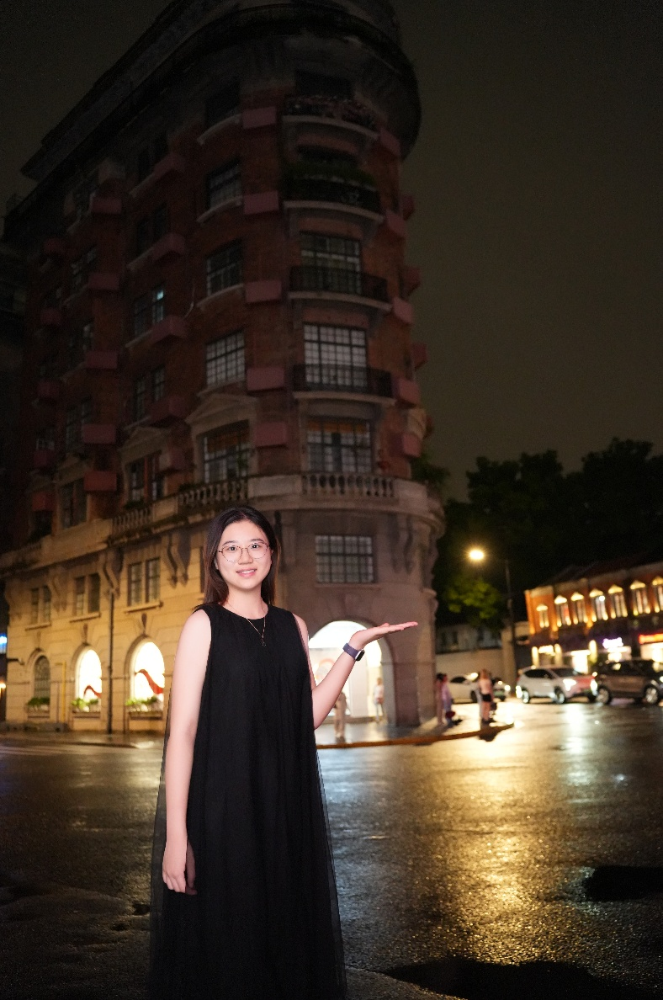
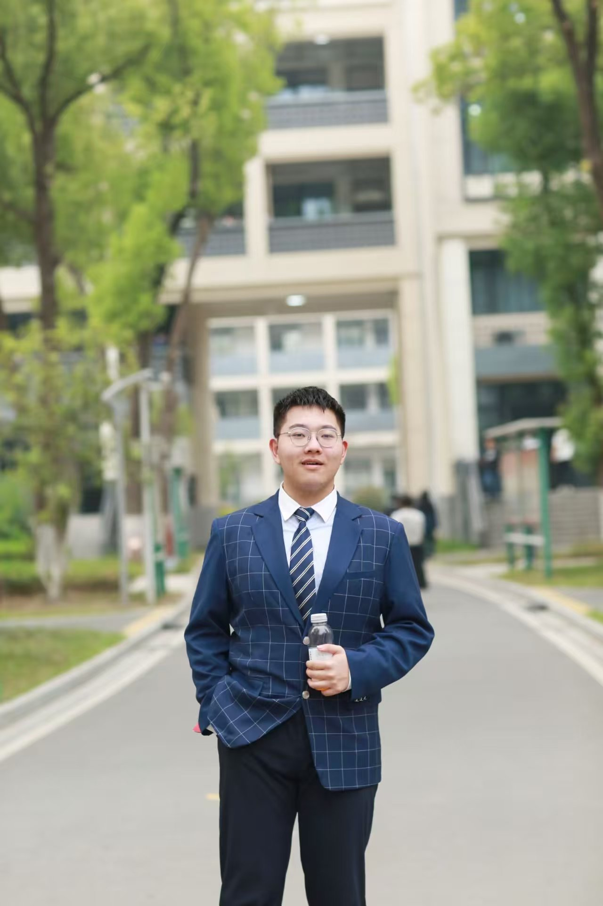

::: {.page-intro .people-intro}
# People {.page-title .initial-accent}

Owl Lab 持续成长中，以下是一起研究、学习和工作的团队成员。

:::

::: {.people-section .pi-section}
## PI

::: {.pi-profile}
{.person-photo .pi-photo alt="欧阳婉璐 / Wanlu Ouyang"}

::: {.person-details}
### 欧阳婉璐

Wanlu Ouyang

助理教授 / 特聘研究员

南京大学建筑与城市规划学院  
School of Architecture and Urban Planning, Nanjing University

[wanlu.oy@nju.edu.cn](mailto:wanlu.oy@nju.edu.cn)  
[Google Scholar](https://scholar.google.com/citations?user=BikRr74AAAAJ&hl=en) · [ResearchGate](https://www.researchgate.net/profile/Wanlu-Ouyang)
:::
:::
:::

::: {.people-section}
## Graduate Researchers

::: {.graduate-profile .student-profile}
{.person-photo .student-photo alt="李雨婷"}

::: {.person-details}
### 李雨婷

建筑专硕 · 2024–至今

关注城市树木三维形态、城市微气候与人体热舒适，研究树高、冠幅、PAI、冠层密度等形态参数如何影响近地微气候与热舒适。

<a href="mailto:522024360021@smail.nju.edu.cn">522024360021@smail.nju.edu.cn</a>

兴趣：健身、养宠物，也喜欢体验新鲜而有挑战的事物。

:::
:::

::: {.graduate-profile .student-profile}
{.person-photo .student-photo alt="陈佳静"}

::: {.person-details}
### 陈佳静

建筑专硕 · 2025–至今

关注微气候代理模型搭建，以及基于室外热舒适度改善的植被优化设计研究。

<a href="mailto:jiajingchen@smail.nju.edu.cn">jiajingchen@smail.nju.edu.cn</a>

兴趣：手工、推理类节目、桌游，也喜欢旅行和城市漫步。

:::
:::
:::

::: {.people-section .current-projects}
## Current Projects

::: {.student-project data-project-id="qingke"}
### 青科项目

2026年4月—2026年12月

关注校园公共空间中的环境属性、微气候表现及休憩行为特征。

::: {.project-members}
::: {.student-profile}
{.person-photo .student-photo alt="冯匡尧"}
<h3>冯匡尧</h3>

智慧人居实验班本科生 · 2025–至今

关注微气候条件与校园公共空间使用行为之间的关系。

<a href="mailto:251294002@smail.nju.edu.cn">251294002@smail.nju.edu.cn</a>

兴趣：音乐、拼装。

:::
::: {.student-profile}
{.person-photo .student-photo alt="戴心诚"}
<h3>戴心诚</h3>

智慧人居实验班本科生 · 2025–至今

关注数据分析、前端与可视化在项目整理和表达中的应用。

<a href="mailto:251294015@smail.nju.edu.cn">251294015@smail.nju.edu.cn</a>

兴趣：徒步、摄影与视觉设计。

:::
::: {.student-profile}
{.person-photo .student-photo alt="刘浩宇"}
<h3>刘浩宇</h3>

智慧人居实验班本科生 · 2025–至今

关注计算机视觉与多模态模型在环境行为观测中的应用。

<a href="mailto:251294016@smail.nju.edu.cn">251294016@smail.nju.edu.cn</a>

兴趣：围棋。

:::
::: {.student-profile}
{.person-photo .student-photo alt="孙乙珈"}
<h3>孙乙珈</h3>

智慧人居实验班本科生 · 2025–至今

关注微气候数据与行为观测数据的处理及其关联。

<a href="mailto:251293005@nju.edu.cn">251293005@nju.edu.cn</a>

兴趣：书法、阅读与钢琴。

:::
:::
:::
:::

::: {#join-us .join-us-note}
Interested in joining us?

如果你希望进一步了解 Owl Lab 的申请与联系方式，请阅读 [Join Us →](join/index.qmd){.text-link}
:::
